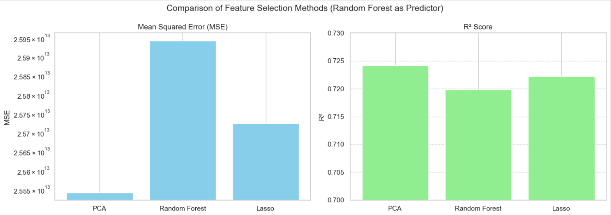
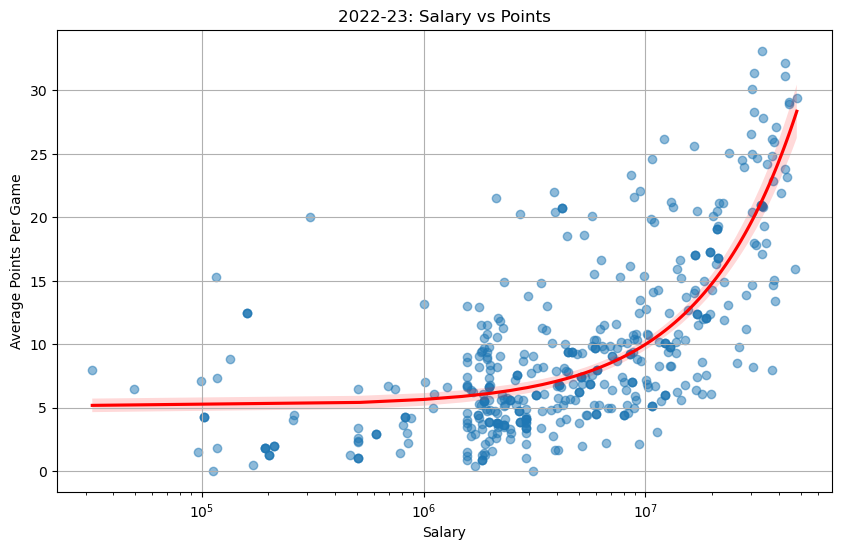
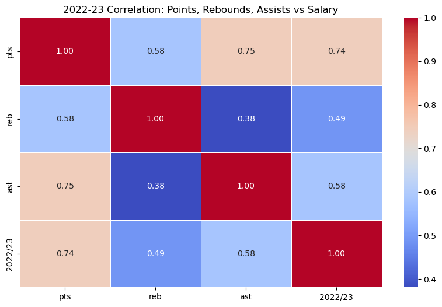
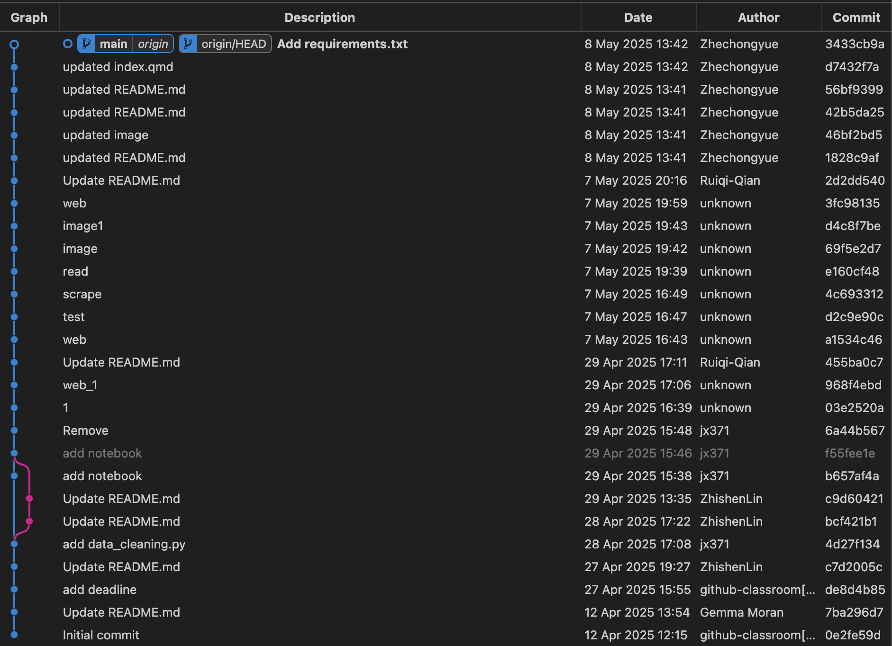

# MSDS-597 Project

Group: 5

## Project summary

Our project summary can be found:

- as a website:

https://ruiqi-qian.github.io/NBA/

## Accessing data

Our raw data can be downloaded here:

https://rutgers.box.com/s/2d8b2lxy0z238jw5ar5fafu6kysh9o9q

Our processed data can be downloaded here:

https://rutgers.box.com/s/yb6srg0fuck95u3ktjayzskzdecpqra5

NOTE: do not include your data in your git repo - it will likely be too large and cause issues.

## Python scripts / notebooks

The following scripts/notebooks were used produce the summary:

- `src/script.py`
- `notebooks/data_cleaning.ipynb`
- `notebooks/data_enrichment.ipynb`
- `notebooks/data_analysis.ipynb`

[Give a short description of what the notebooks contain, and their location in the git repo]

# data_cleaning/data_cleaning.ipynb

This notebook focuses on cleaning and preprocessing the raw NBA datasets. Key tasks include handling missing values, converting data types, standardizing formats, and selecting relevant features. It ensures the data is ready for analysis and modeling in subsequent stages.

# visualization/visual.ipynb

This notebook provides visual insights into the NBA data through various plots and charts. It explores relationships between player salaries and performance metrics such as points, rebounds, and assists. Visualizations help uncover trends and patterns that support the modeling phase.

# model/Model.ipynb

This notebook develops predictive models to analyze or forecast NBA player salaries based on performance and other features. Techniques may include linear regression or machine learning algorithms. It evaluates model performance and interprets the results in context. We used lasso regression, random forest and PCA to choose features and predict the outcome.

## Reproducibility

Provide a `requirements.txt` file with packages and versions of all python packages to run the analysis.

## Guide

### Summary

Your summary should include the following. 

Note: You do not need code in your summary - instead, reference where in your github repo the code is. The priority should be a concise, readable summary. You should include visualizations and conclusions regarding your data analysis.

1. Datasets:
We used two main CSV datasets:
    1) Player performance (PER, TS %, PTS, REB, AST, etc.) sourced from a public GitHub repo (madhurn1/PredictiveNBAContractValuationModel) covering the 2019 – 2024 seasons.
    2) Annual salaries for the same players for 2019/20–2023/24, obtained from a Kaggle dataset (Justinas’s NBA Players Data).
Both are simple, comma‑delimited files updated once per season, with key fields like playerName (or Player), season columns (e.g. 2021/22), and per‑game metrics .

2. Data Retrieval: 
All raw CSVs were downloaded manually via the Kaggle and GitHub web interfaces. No APIs or scraping were required .

3. Data cleaning & tidying:
We loaded NBA player stats and salary data from 2019–2024. We cleaned the data by: 
    1) Dropping missing values (e.g., in PER, TS%, salary, and position). 
    2) Standardizing column names (e.g., changing Player to player_name). 
    3) Selecting important columns like Season, Player, PER, TS%, Salary, and Position. 
    4) Splitting the data by season for easier processing. 
    5) Merging player stats with their position data, ensuring no missing positions. 
At each stage, we saved cleaned datasets to CSV files, preparing tidy, analysis-ready data organized by season.

4. Validation tests:
Throughout cleaning we verified:
    1) Row counts via print(df.shape) and sample df.head().
    2) No missing values in key fields with df.isnull().sum() == 0.
    3) Reasonable value ranges by inspecting df.describe() for outliers or nonsensical entries.

5. Data enrichment:
    1) Created a consolidated PER‑TS% table (PER‑TS%.csv) for quick analysis of season‑by‑season efficiency metrics.
    2) Added a unified season column in the analysis notebook (Model.ipynb) to tag each record with “2019‑20”, “2020‑21”, etc., enabling cross‑season concatenation.
    3) Derived correlation subsets (PTS, REB, AST vs. salary) for targeted heatmap generation .

6. Descriptive statistics:
    1) Used df.describe() to report mean, median, quartiles, and standard deviations for numeric fields across seasons.
    2) Tabulated average salary by position to highlight pay gaps (e.g. guards vs. centers).
    3) Summarized PER and TS % distributions to identify shifts in league‑wide efficiency over time .

7. Visualizations:
    1) Boxplot of Player Efficiency Rating (PER) by Season 
      
    From 2019–20 through 2023–24, the PER distribution has grown wider, indicating greater disparity in individual efficiency. This means teams may exploit efficiency outliers—both recruiting high‑end performers and avoiding low‑efficiency contracts.
    2) Density Plot of Points per Game (PTS) Over Time 
      
    League‑wide scoring has crept upward each season, with 2023–24 showing the highest mean PTS density shift, indicating the modern NBA’s pace‑and‑space style continues to elevate scoring outputs.
    3) Salary vs. Points per Game (Log Scale) 
      
    There’s a clear log‑linear salary premium: each additional PPG beyond ~20 yields an outsized pay bump. For high‐scoring “superstars”, they are able to capture exponentially larger contracts.
    4) Correlation Heatmap of Performance Metrics vs. Salary
      
    PTS (r≈0.74) correlates most strongly with salary, followed by AST (r≈0.58) and REB (r≈0.49). It shows that scoring remains the dominant driver of pay, though rebounding and playmaking are also rewarded.

8. Git Commit History:

